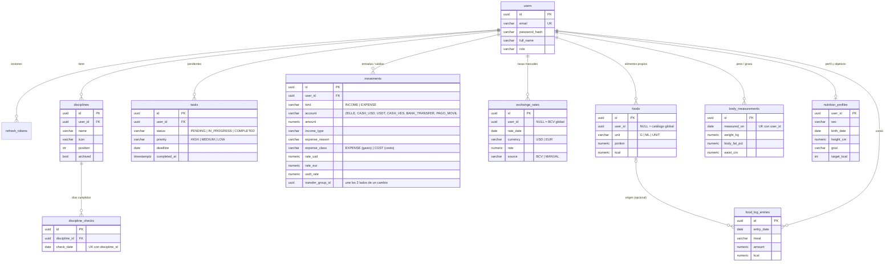

# Planificación diaria · API

API REST con **Spring Boot 4.1 (Java 21)**, **PostgreSQL 17** y autenticación **JWT**.
Cubre usuarios, disciplinas y planificación diaria, pendientes, finanzas y nutrición.

## Arrancar en local

Requisitos: JDK 21 (`JAVA_HOME`) y Docker Desktop. No hace falta instalar Maven (se usa `mvnw`).

```bash
cd backend
docker compose up -d          # Postgres en localhost:5433
./mvnw spring-boot:run        # API en http://localhost:8080
```

- Flyway crea las tablas al arrancar (`src/main/resources/db/migration`).
- El perfil `dev` (activo por defecto) trae una clave JWT de desarrollo. **En producción** define `JWT_SECRET`
  (Base64, ≥ 32 bytes: `openssl rand -base64 48`) y usa otro perfil.
- El host usa el puerto **5433** porque en este equipo hay un PostgreSQL de Windows ocupando el 5432.
  Se cambia con la variable `DB_PORT`.
- Salud: `GET /actuator/health`.

Para probar a mano: [`requests.http`](requests.http) (VS Code con la extensión *REST Client*, o IntelliJ).

## Tests

```bash
./mvnw test
```

- **Unitarios**: cálculos de dinero (promedio USDT, conversiones), plan nutricional y semáforo.
- **Integración** (`ApiIntegrationTest`): recorre la API contra un Postgres real con **Testcontainers**.
  Necesita Docker; si no está corriendo, esos tests se saltan.

## Arquitectura

MVC clásico organizado **por módulo** (no por capa), cada uno con `Entity → Repository → Service → Controller` y DTOs como `record`:

```
com.planificacion.api
├── config       Seguridad, JWT, CORS, reloj, propiedades
├── common       Entidad base, errores (RFC 9457), @CurrentUserId
├── auth         Registro, login, refresh, logout
├── user         Perfil del usuario
├── discipline   Disciplinas (hábitos)
├── planning     Días cumplidos + semáforo
├── task         Pendientes
├── finance      Movimientos, cambios de divisas, tasas BCV, resumen
└── nutrition    Alimentos, diario, cuerpo, perfil y plan
```

Decisiones clave:

- **Sin estado**: cada petición trae `Authorization: Bearer <jwt>`. La validación (firma HS256, expiración, emisor)
  la hace el *resource server* de Spring Security; no hay filtros JWT caseros.
- **Access token corto (15 min) + refresh token (30 días)**. El refresh se guarda **hasheado (SHA-256)**,
  **rota en cada uso** y, si alguien reutiliza uno viejo, se revocan todas las sesiones del usuario.
- **Multiusuario seguro**: el id del usuario sale del token (`@CurrentUserId`), nunca del body/URL.
  Todas las consultas filtran por `user_id`; acceder a algo ajeno da **404** (no revela que existe).
- **El esquema es de Flyway**; Hibernate solo lo valida (`ddl-auto=validate`).
- **Errores** en formato `application/problem+json` con el detalle por campo en `errors`.
- **Snapshots**: los movimientos guardan la tasa BCV del día y el diario guarda los macros calculados,
  así el historial no cambia si luego cambia la tasa o el alimento.

## Modelo de datos



Todas las tablas tienen `created_at` / `updated_at`. Las reglas importantes también están en la BD
(`CHECK`, `UNIQUE`, `ON DELETE CASCADE`): por ejemplo, un pendiente tiene `completed_at` si y solo si está completado,
y una entrada no puede tener campos de salida.

## Endpoints

Todo bajo `/api`. Salvo `auth/*`, todo requiere `Authorization: Bearer <accessToken>`.

| Módulo | Método y ruta | Qué hace |
|---|---|---|
| Auth | `POST /auth/register` · `/auth/login` | Devuelve access + refresh token |
| | `POST /auth/refresh` · `/auth/logout` | Rotar / revocar refresh token |
| Usuario | `GET/PATCH /users/me` · `PUT /users/me/password` | Perfil y contraseña |
| Disciplinas | `GET/POST /disciplines` · `GET/PUT/DELETE /disciplines/{id}` | CRUD (`?includeArchived=true`) |
| | `PUT /disciplines/order` | Reordenar |
| Planificación | `GET /planning?from=&to=` | Días, cumplidas y semáforo + resumen |
| | `PUT/DELETE /planning/{fecha}/disciplines/{id}` | Marcar / desmarcar |
| Pendientes | `GET /tasks?status=` · `POST /tasks` | Lista (activos por defecto) y crear |
| | `GET/PUT/DELETE /tasks/{id}` · `PATCH /tasks/{id}/status` | CRUD y cambio de estado |
| Finanzas | `GET /finance/movements?month=&kind=` · `POST` | Entradas / salidas |
| | `GET/PUT/DELETE /finance/movements/{id}` | Borrar un cambio borra sus dos lados |
| | `POST /finance/exchanges` | Cambio / venta de divisas (salida + entrada enlazadas) |
| | `GET /finance/summary?month=` | Saldos por cuenta, totales $/Bs/€, promedio USDT, mes, 6 meses |
| | `GET /finance/rates?date=` · `POST /finance/rates/refresh` · `PUT /finance/rates/manual` | Tasas BCV |
| Nutrición | `GET /nutrition/foods?q=` · `POST` · `PUT/DELETE /nutrition/foods/{id}` | Catálogo + propios |
| | `GET /nutrition/diary?date=` · `GET /nutrition/diary/totals?from=&to=` | Día con % por macro / totales |
| | `POST /nutrition/diary/entries` · `PUT/DELETE .../{id}` · `POST /nutrition/diary/copy` | Registrar comidas |
| | `GET /nutrition/body` · `PUT /nutrition/body` · `DELETE /nutrition/body/{id}` | Peso, grasa, IMC |
| | `GET/PUT /nutrition/profile` · `PUT /nutrition/profile/targets` | Perfil y objetivos |
| | `GET /nutrition/plan` · `POST /nutrition/plan/apply` | Calcular / aplicar plan |

La tasa BCV se obtiene de `ve.dolarapi.com` (servicio público, no oficial del BCV) al pedirla y cada 3 horas.
